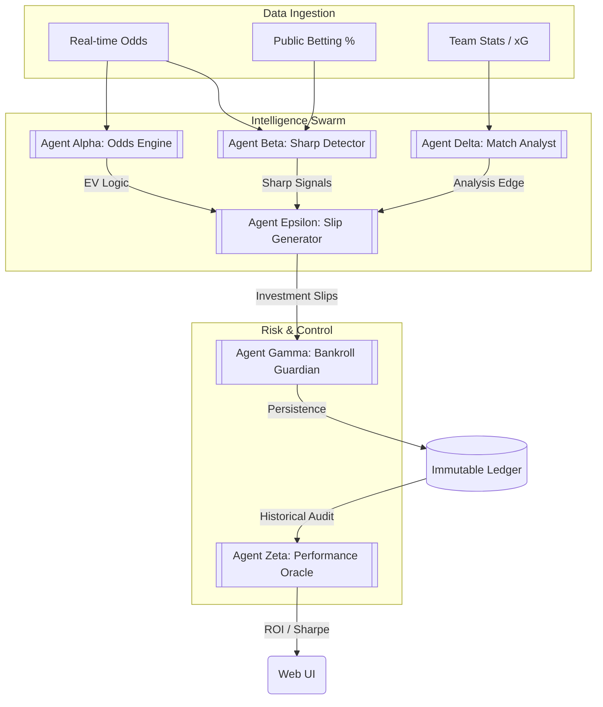

# The House Edge: Professional Betting Intelligence Platform 📈💰

**The House Edge** is a professional intelligence platform that treats sports betting with the rigor of high-frequency financial trading. Built with Clojure, it manages massive streams of concurrent data while maintaining a rigorous, immutable audit trail of every decision.

### 🏗️ Why "The House Edge"?
In a market dominated by emotional betting and surface-level stats, The House Edge provides a systematic edge through:
- **Sharp Money Detection:** Identifying when the "smart money" moves before the public.
- **Real-time Odds Analysis:** High-frequency monitoring of 50+ bookmakers.
- **Algorithmic Bankroll Management:** Applying the Kelly Criterion to maximize long-term ROI.

### ### Transferability to Football Scouting
While built for the betting markets, the core engine of The House Edge is a direct blueprint for modern football recruitment:
- **Player Value Inefficiencies:** The same multi-agent logic that finds value in betting lines is used to identify undervalued talent in the KPL and regional leagues.
- **Risk Management for Transfers:** Applying financial risk thresholds to recruitment budgets ensures every transfer is backed by data-driven ROI analysis.
- **Moneyball for Africa:** Turning betting intelligence into a tactical recruitment edge for East African clubs.

---

📐 Full Technical Architecture & Design

## 🏗 System Architecture

## 🧠 The Multi-Agent Architecture
The system is built as a collaborative swarm of specialized agents:
- **Agent Alpha (Odds Engine):** Real-time normalization of global odds.
- **Agent Beta (Sharp Detector):** Filters volume vs. movement to find institutional money.
- **Agent Gamma (Bankroll Guardian):** Enforces Kelly Criterion and stop-losses.
- **Agent Delta (Match Analyst):** Ingests xG and historical form.

## 💎 The Clojure Advantage
- **Immutability by Default:** Every line movement is stored as immutable data.
- **Concurrency (Agents & Atoms):** Non-blocking analysis of 50+ bookmakers simultaneously.
- **Data-Driven Logic:** Prismatic Schema for strict inter-agent communication.
- **REPL-Driven Development:** Hot-reloading strategies in production.

## 🛠 Tech Stack
- **Lisp Runtime:** Clojure 1.11
- **UI Architecture:** ClojureScript + Reagent + Re-frame
- **Persistence:** EDN-based immutable ledger
- **Server:** Ring + Jetty + Compojure
- **Validation:** Prismatic Schema

---
**Open for collaborations with KPL clubs & scouting teams — DM me!**
