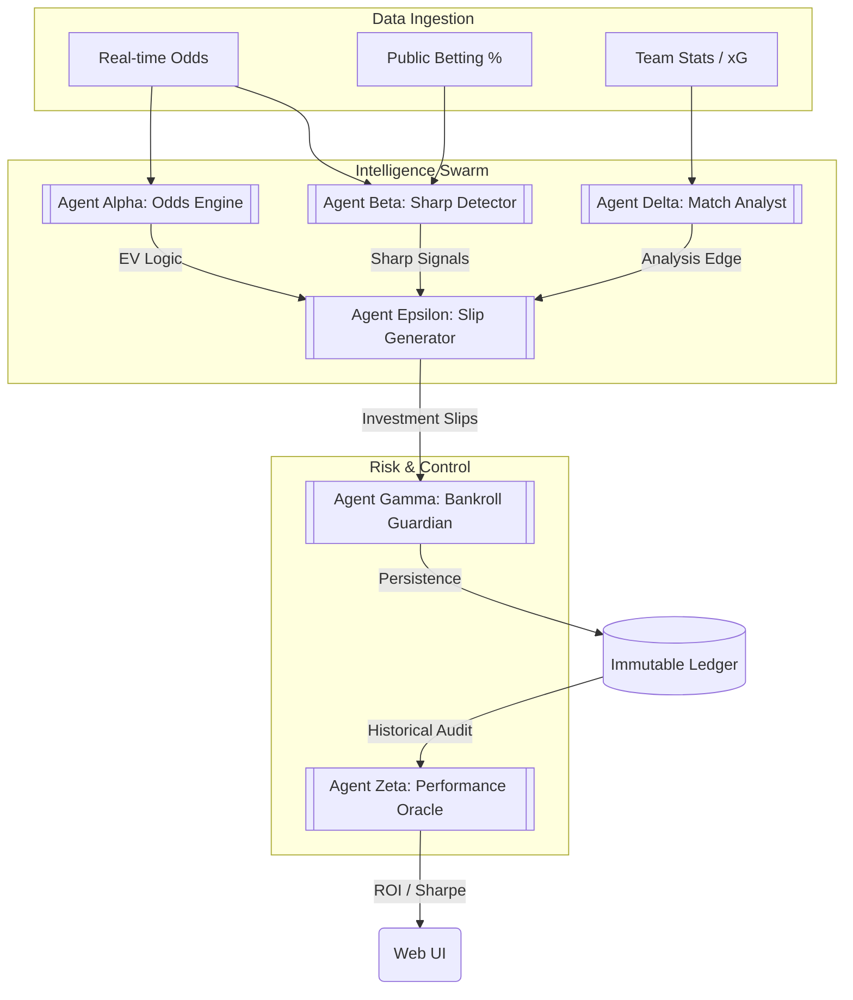

# 🎯 The House Edge

[](https://github.com/dennisgathu8/house-hedge/actions/workflows/clojure.yml)
[](https://opensource.org/licenses/MIT)

> **Professional Betting Intelligence Platform** – A sophisticated, multi-agent system designed for high-frequency odds analysis, sharp money detection, and algorithmic bankroll management.

---

## 🏗 System Architecture



---

## 🚀 Why "The House Edge"?

In a market dominated by emotional betting and surface-level stats, **The House Edge** treats sports betting as high-frequency financial trading. It leverages the unique power of **Clojure** to manage massive streams of concurrent data while maintaining a rigorous, immutable audit trail of every decision.

### 🧠 The Multi-Agent Architecture
The system is built as a collaborative swarm of specialized agents, each holding a single responsibility:

| Agent | Responsibility |
| :--- | :--- |
| **Α Alpha (Odds Engine)** | Real-time ingestion of global odds with EV (Expected Value) calculation. |
| **Β Beta (Sharp Detector)** | Monitors "Steam Moves" and "Reverse Line Movement" to shadow professional money. |
| **Γ Gamma (Bankroll Guardian)** | Enforces professional staking (Kelly Criterion/Flat) with an immutable persistent ledger. |
| **Δ Delta (Match Analyst)** | Deep-dives into xG (Expected Goals), form weighting, and historical variance. |
| **Ε Epsilon (Slip Generator)** | Synthesizes agent inputs into "Investment-Grade" betting recommendations. |
| **Ζ Zeta (Performance Oracle)** | Real-time ROI, Sharpe Ratio calculation, and variance reporting. |

---

## 💎 The Clojure Advantage

This project is a showcase of why Clojure is the premier choice for financial/betting systems:

- **Immutability by Default**: Every bet recorded, every line movement, and every bankroll snapshot is stored as immutable data. We don't change state; we calculate the next reality.
- **Concurrency (Agents & Atoms)**: Real-time odds from 50+ bookmakers don't block the UI or the analysis. Clojure's concurrency primitives make this trivial.
- **Data-Driven Logic**: Using `schema.core`, we ensure that inter-agent communication is strictly typed and validated, preventing the runtime errors that plague traditional JS/Python stacks.
- **REPL-Driven Development**: The entire strategy can be tuned and hot-reloaded in production without a restart.

---

## 🛠 Tech Stack

- **Lisp Runtime**: Clojure 1.11
- **UI Architecture**: ClojureScript + Reagent (React) + Re-frame (State Management)
- **Persistence**: EDN-based immutable ledger (Disk-backed)
- **Server**: Ring + Jetty + Compojure
- **Validation**: Prismatic Schema

---

## 🏁 Getting Started

### Prerequisites
- [Leiningen](https://leiningen.org/) (Project Automation)
- Java 11+

### Installation
```bash
git clone https://github.com/dennisgathu8/house-hedge.git
cd house-hedge
```

### Running the Professional Demo
See the agents in action as they process mock weekend fixtures and generate investment slips:
```bash
lein run -m the-house-edge.core --demo
```

### Running the Dashboard
1. **Launch the Frontend**: `lein figwheel`
2. **Launch the API**: `lein run -m the-house-edge.core`
3. View at: `http://localhost:3000`

---

## 📈 Roadmap & MVP Status
Currently, the system is in **Phase 1 (Validation)**:
- [x] Multi-agent orchestration framework.
- [x] Professional staking (Kelly Criterion).
- [x] Immutable persistence layer.
- [ ] Real-time integration with The-Odds-API / Pinnacle.
- [ ] Distributed Consensus for multi-node deployments.

---

## ⚖️ License
Distributed under the MIT License. See `LICENSE` for more information.

Developed with 🥂 by [Dennis Gathu](https://github.com/dennisgathu8).
